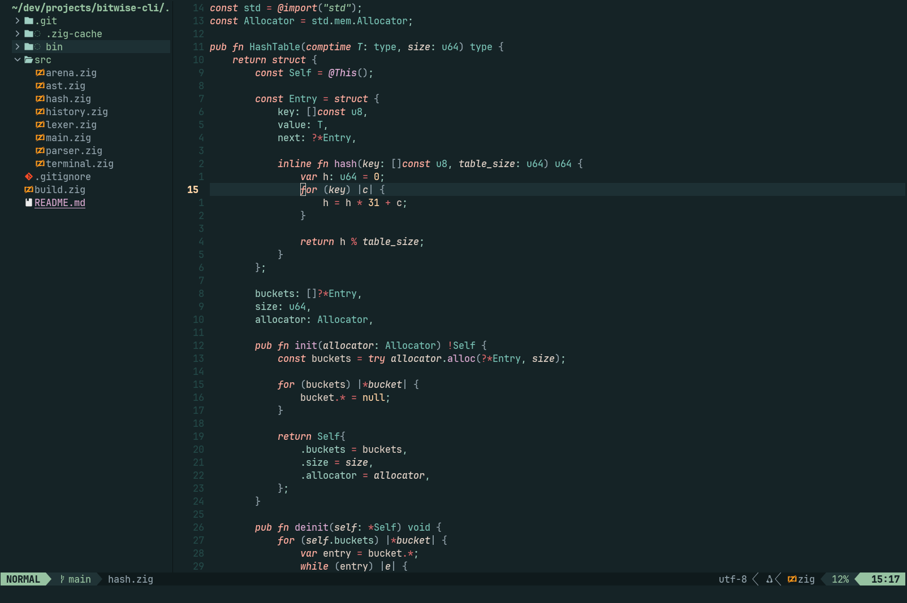
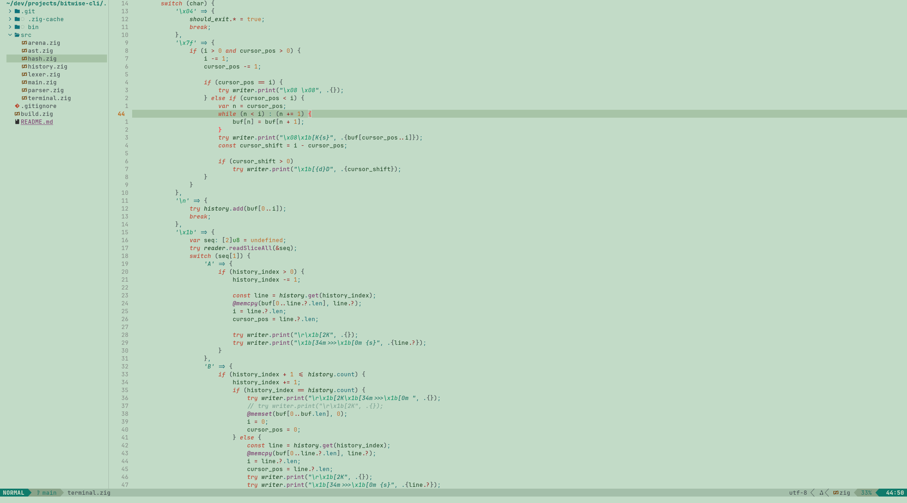

# Thorn

A dark and light theme for [Neovim](https://github.com/neovim/neovim). Features rich greens and subtle contrast to make a simple, _easy on the eyes_ theme.

> [!note]
> This theme is under **ACTIVE DEVELOPMENT**. Some highlights may be tweaked occasionally, as well as support for certain features/plugins being added over time. However, the overall look and feel of the theme will remain the same.
>
> If you want support for a specific plugin, please open an issue and it **will** be added.




### Features

---

- Written in 100% Lua
- Supports
  - Treesitter
  - LSP
  - [lazy.nvim](https://github.com/folke/lazy.nvim)
  - [telescope.nvim](https://github.com/nvim-telescope/telescope.nvim)
  - [gitsigns.nvim](https://github.com/lewis6991/gitsigns.nvim)
  - [trouble.nvim](https://github.com/folke/trouble.nvim)
  - [nvim-cmp](https://github.com/hrsh7th/nvim-cmp)
  - [nvim-tree.lua](https://github.com/nvim-tree/nvim-tree.lua)
  - [lualine.nvim](https://github.com/nvim-lualine/lualine.nvim)
  - [bufferline.nvim](https://github.com/akinsho/bufferline.nvim)
- Comes with added [Ghostty](https://github.com/ghostty-org/ghostty) themes!
  - Dark and Light themes available in `extras`

### Installation

---

[lazy.nvim](https://github.com/folke/lazy.nvim)

```lua
{
    "jpwol/thorn.nvim",
    lazy = false,
    priority = 1000,
    opts = {}
}
```

[packer.nvim](https://github.com/wbthomason/packer.nvim)

```lua
use {
    "jpwol/thorn.nvim",
    config = function()
        require("thorn").setup({})
    end,
}
```

[vim-plug](https://github.com/junegunn/vim-plug)

```lua
Plug 'jpwol/thorn.nvim', { 'branch': 'main' }
```

### Usage

---

```lua
-- after plugin is loaded by your manager
vim.cmd([[colorscheme thorn]])
```

For _LuaLine_

```lua
require("lualine").setup({
    options = {
        theme = "thorn" -- "auto" also detects theme automatically
    }
})
```

### Configuration

---

_thorn_ provides a few customization options right now, as well as a way to change the color/style of any highlight group of your choosing.

In your _lazy_ plugin,

```lua
return {
    "jpwol/thorn.nvim",
    lazy = false,
    priority = 1000,
    opts = {
        theme = nil, -- light or dark

        styles = {
            keywords = { italics = true, bold = false },
            comments = { italics = true, bold = false },
            strings  = { italics = true, bold = false },

            diagnostic = {
                underline = true, -- if true, flat underlines will be used. Otherwise, undercurls will be used

                -- true will apply the bg highlight, false applies the fg highlight
                error = { highlight = true, },
                hint  = { highlight = false, },
                info  = { highlight = false, },
                warn  = { highlight = false, },
            },
        },

        transparent = false, -- transparent background

        on_highlights = function(hl, palette) end, -- apply your own highlights
    },
}
```

Where `on_highlights` will be a function, and you can edit any highlight group using `hl.<Highlight Group>.<attribute> = <option>`. An example of this would be:

```lua
on_highlight = function(hl, palette)
    hl.String.bold = true
    hl.Function.fg = "#ffffff"
end
```

This would be similar with _packer_, but instead of `opts = {}` you would put the contents of the table within `setup({})`.
