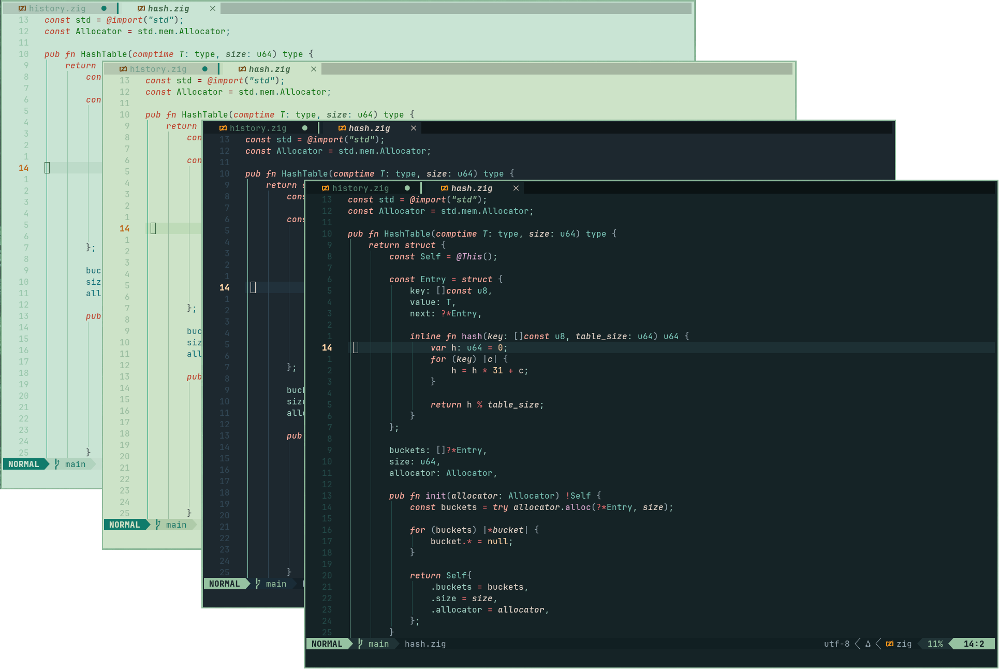
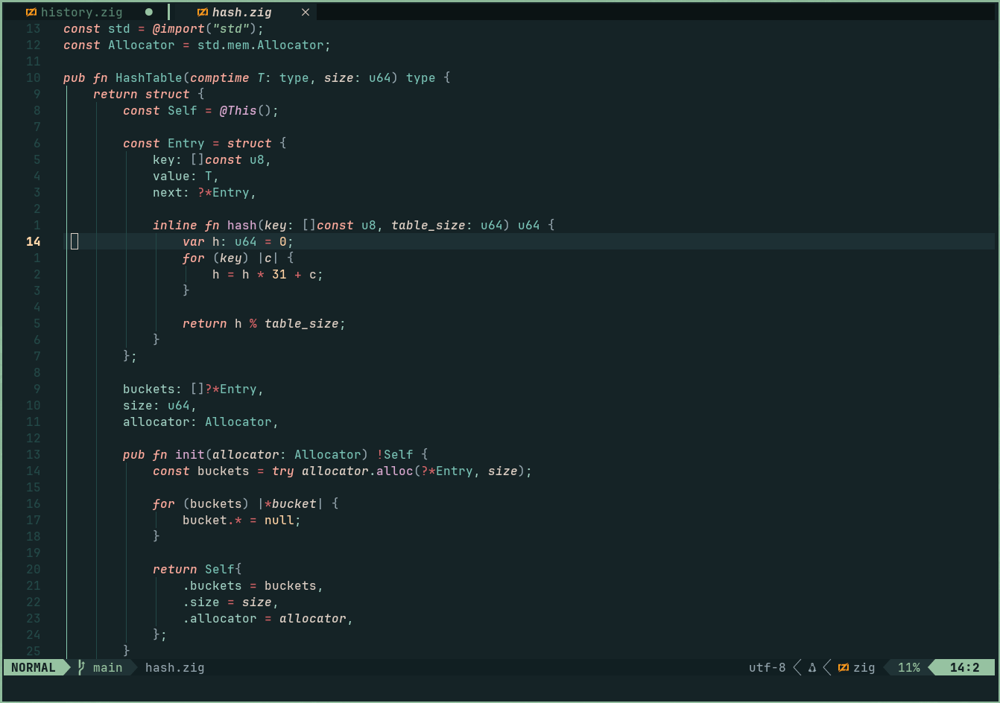
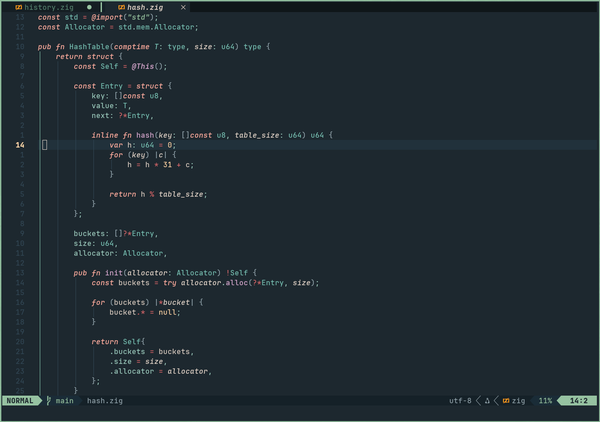
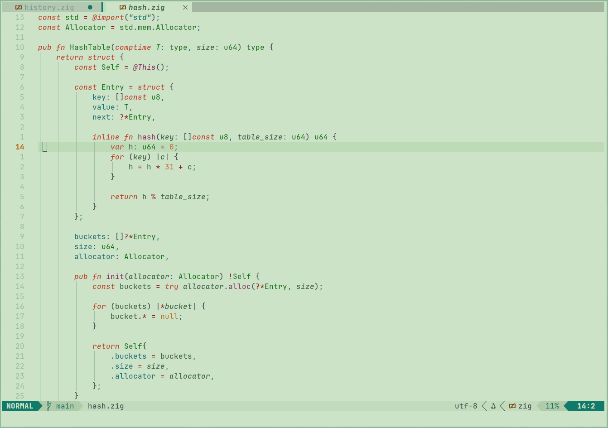
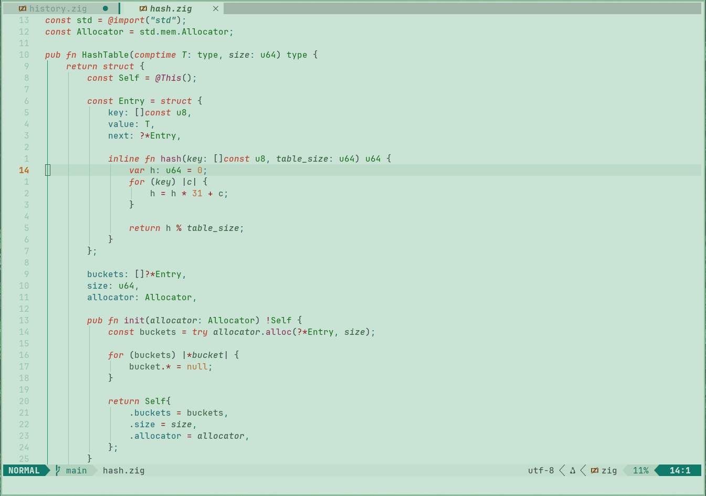

<h3 align="center">
    Thorn<br/>
    
</h3>

<p align="center">
    <a href="https://github.com/jpwol/thorn.nvim/stargazers"></a>
    <a href="https://github.com/jpwol/thorn.nvim/issues"></a>
    <a href="https://github.com/jpwol/thorn.nvim/issues"></a>
</p>

<div align="center">
    
</div>

Thorn is a rich, green theme made to solve two issues with many themes:

##### Too many highlights

Many themes have a vast amount of highlights, creating a sort of abstract painting when looking at code. Thorn aims to cut down on the amount of different colors with a _small_ palette, making code much more traversable at a glance.

##### Too high contrast

A lot of dark themes are only dark in the sense of their backgrounds. For those with sensitive eyes, high contrast highlights can be straining after awhile. Thorn mitigates this by using soft, low-contrast highlights that are still easily readable, making a long session much more sustainable on the eyes.

## Table of Contents

- [Previews](#previews)
- [Features](#features)
- [Installation](#installation)
- [Usage](#usage)
- [Configuration](#configuration)

---

#### Previews

<details>
    <summary> Dark Warm </summary>
    
</details>
<details>
    <summary> Dark Cold </summary>
    
</details>
<details>
    <summary> Light Warm </summary>
    
</details>
<details>
    <summary> Light Cold </summary>
    
</details>

## Features

- Written in 100% Lua
- **Dark** and **Light** themes available, each with a _warm_ and _cold_ background
  - See [Configuration](#configuration) for details
- Plugin support
  - [lazy.nvim](https://github.com/folke/lazy.nvim)
  - [telescope.nvim](https://github.com/nvim-telescope/telescope.nvim)
  - [gitsigns.nvim](https://github.com/lewis6991/gitsigns.nvim)
  - [trouble.nvim](https://github.com/folke/trouble.nvim)
  - [nvim-cmp](https://github.com/hrsh7th/nvim-cmp)
  - [nvim-tree.lua](https://github.com/nvim-tree/nvim-tree.lua)
  - [lualine.nvim](https://github.com/nvim-lualine/lualine.nvim)
  - [bufferline.nvim](https://github.com/akinsho/bufferline.nvim)
  - [snacks.nvim](https://github.com/folke/snacks.nvim)
  - [render-markdown.nvim](https://github.com/MeanderingProgrammer/render-markdown.nvim)
- Comes with added themes for **other applications** (see [extras](https://github.com/jpwol/thorn.nvim/tree/main/extras))!
  - [Ghostty](https://github.com/ghostty-org/ghostty)
  - [Kitty](https://github.com/kovidgoyal/kitty)
  - [Alacritty](https://github.com/alacritty/alacritty)
  - [Btop](https://github.com/aristocratos/btop)

> [!note]
> If you want support for a plugin, open an issue and it **WILL** be added!

## Installation

[lazy.nvim](https://github.com/folke/lazy.nvim)

```lua
{
    "jpwol/thorn.nvim",
    lazy = false,
    priority = 1000,
    opts = {}
}
```

[packer.nvim](https://github.com/wbthomason/packer.nvim)

```lua
use {
    "jpwol/thorn.nvim",
    config = function()
        require("thorn").setup({})
    end,
}
```

[vim-plug](https://github.com/junegunn/vim-plug)

```lua
Plug 'jpwol/thorn.nvim', { 'branch': 'main' }
```

## Usage

```lua
-- after plugin is loaded by your manager
vim.cmd([[colorscheme thorn]])
```

For _LuaLine_

```lua
require("lualine").setup({
    options = {
        theme = "thorn" -- "auto" also detects theme automatically
    }
})
```

## Configuration

_thorn_ provides a good amount of customization options, as well as a way to change the color/style of any highlight group of your choosing.

In your plugin setup ([lazy.nvim](https://github.com/folke/lazy.nvim) plugin structure used as reference),

```lua
return {
    "jpwol/thorn.nvim",
    lazy = false,
    priority = 1000,
    opts = {
        theme = nil, -- 'light' or 'dark' - defaults to vim.o.background if unset
        background = "warm", -- options are 'warm' and 'cold'

        transparent = false, -- transparent background
        terminal = true, -- terminal colors

        styles = {
            keywords = { italic = true, bold = false },
            comments = { italic = true, bold = false },
            strings  = { italic = true, bold = false },

            diagnostic = {
                underline = true, -- if true, flat underlines will be used. Otherwise, undercurls will be used

                -- true will apply the bg highlight, false applies the fg highlight
                error = { highlight = true, },
                hint  = { highlight = false, },
                info  = { highlight = false, },
                warn  = { highlight = false, },
            },
        },

        on_highlights = function(hl, palette) end, -- apply your own highlights
    },
}
```

Where `on_highlights` will be a function, and you can edit any highlight group as follows

```lua
on_highlights = function(hl, palette)

    -- setting options by member preserves other options for that group
    hl.String.bold = true
    hl.Function.fg = "#D9ADD4"

    -- setting options by table will CLEAR any other options for that group
    hl.Keyword = { fg = "#F9ADA0", italic = true } -- would clear bold and bg if they were set


    -- you can also use the theme's palette
    hl.String.fg = palette.lightgreen
end
```
